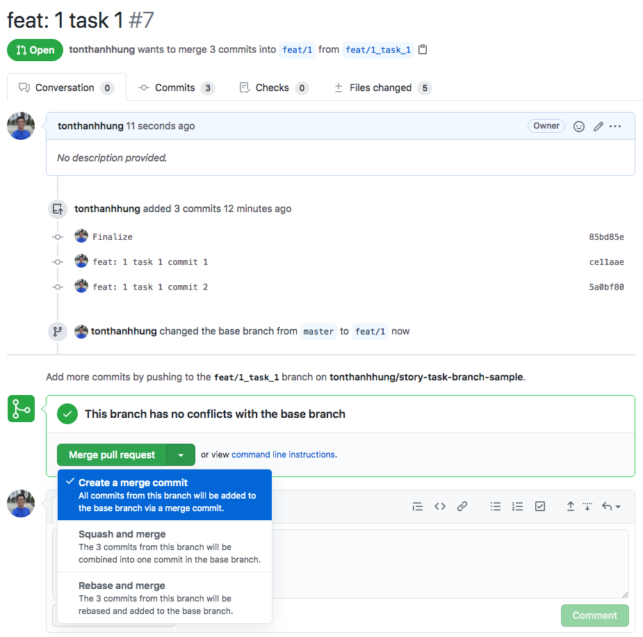
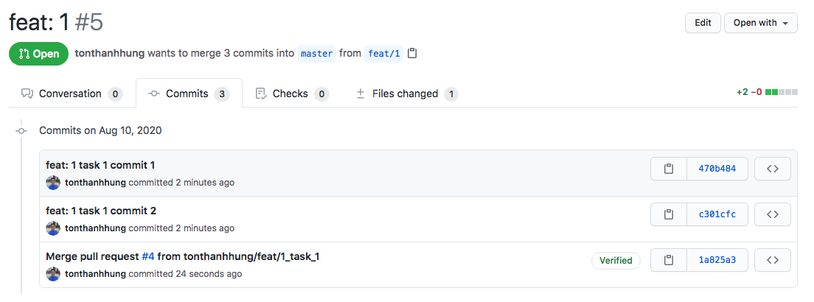
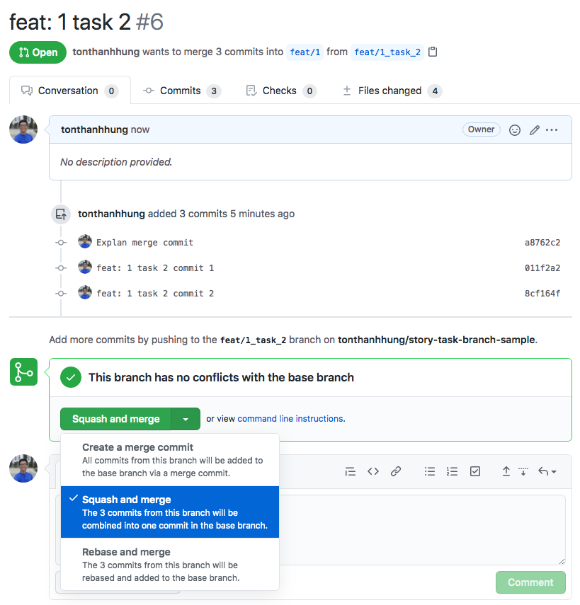
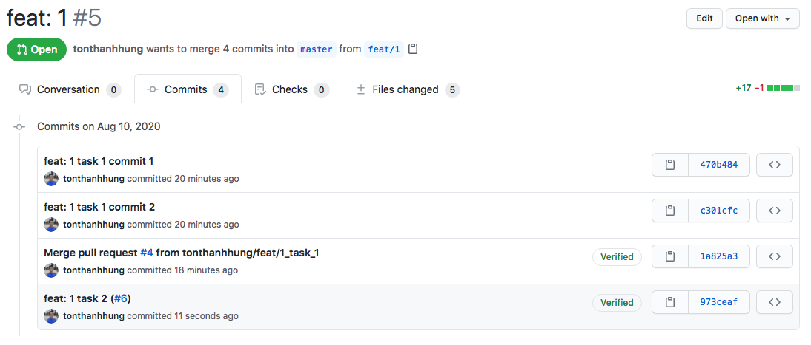
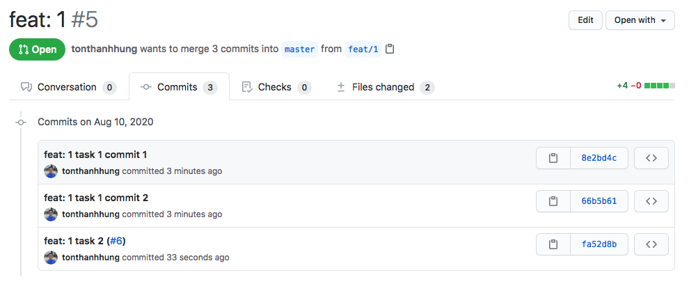
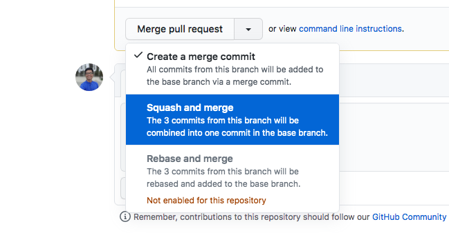

### Story - Task PR Merge Explanation

1. When we merge task brach into story branch, with this selection 

We will come to the result that all commits are list down in the base PR (`feat/1`) like this 

Event though we have a `Verified` Badge, it still list all the commits from the merged PR

2. When we merge task branch into story branch, with this selection 

Then we will have only one additional commit message for the merge PR instead of list all commits

But after rebasing the story PR onto master(or develop), then all the `Verified` label will begone, and also the _merge commit_ from the first example but remaining the 2 child commits and the _squash and merge commit_ as shown below 

## Conclusion
Always use `Squash and merge` option when you want to merge task branch into story branch
