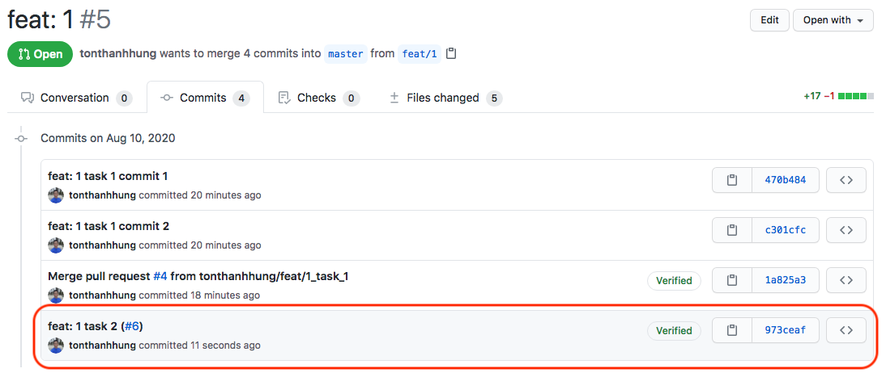

### Story - Task git braching model

1. When we merge task brach into story branch, with this selection 

We will come to the result commits are list down in the base PR (`feat/1`) like this 

Event though we have a `Verified` Badge, it still list all the commit from the merged PR

2. When we merge task branch into story branch, with this selection 

Then we will have only one additional commit message for the merge PR instead of list all commits

